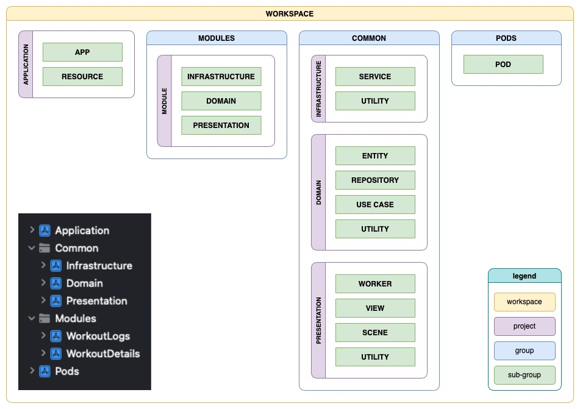
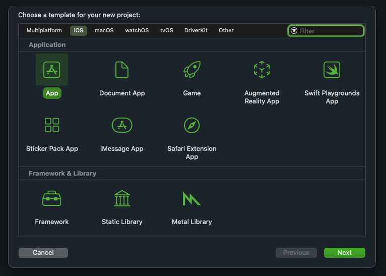
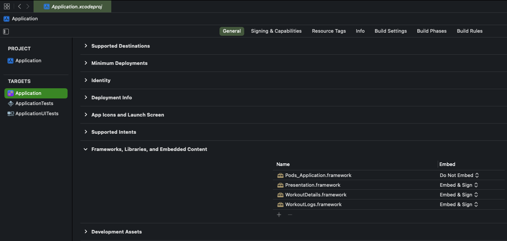
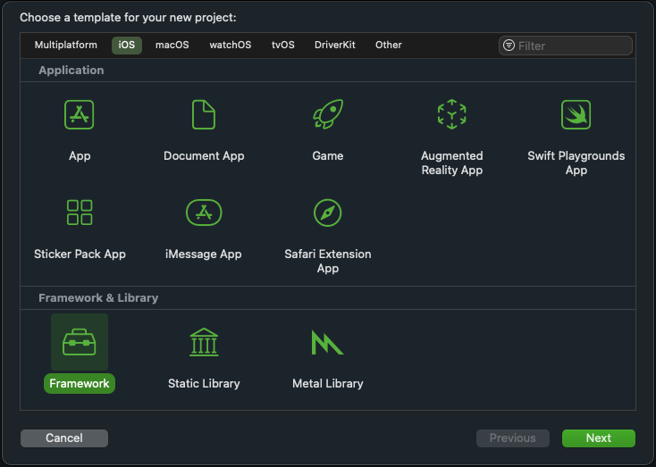
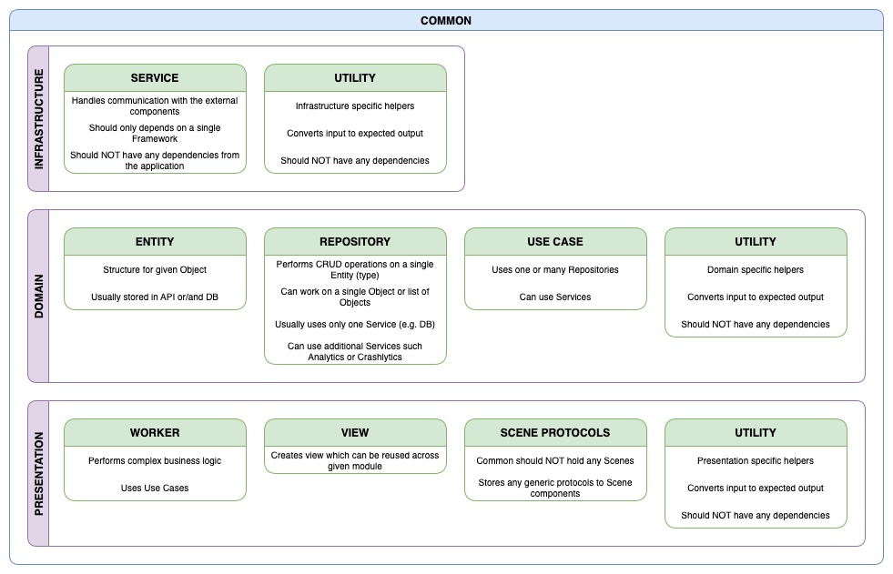
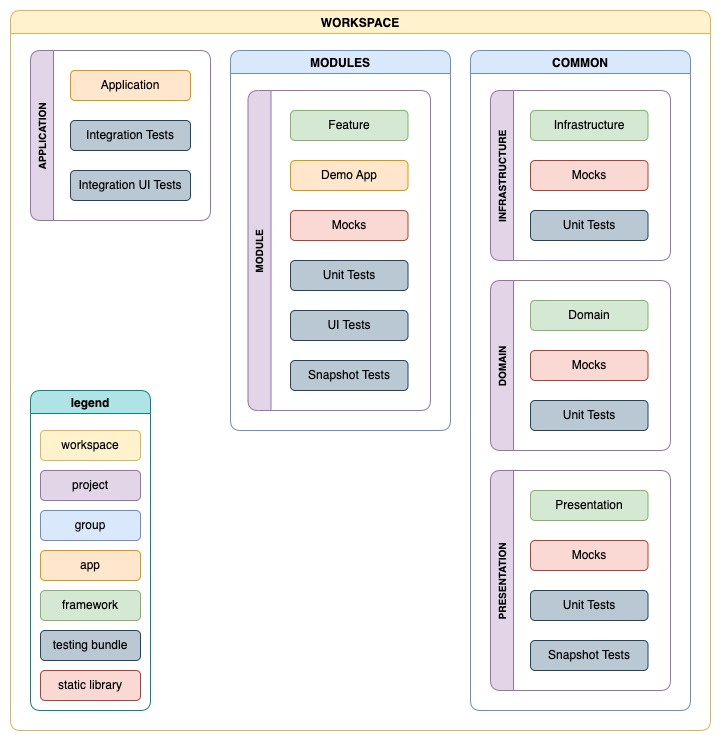
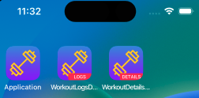
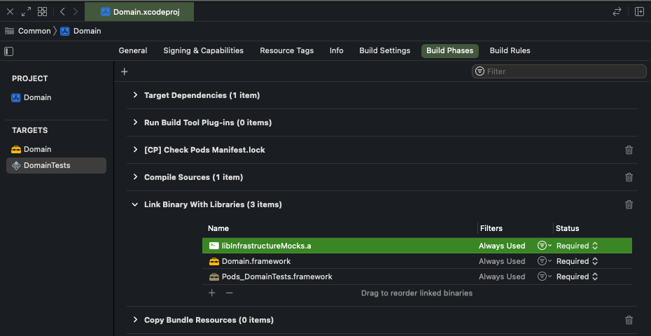
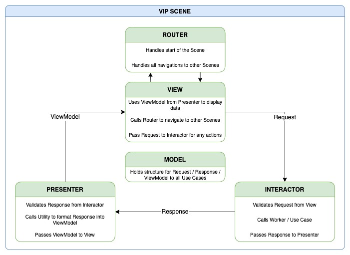
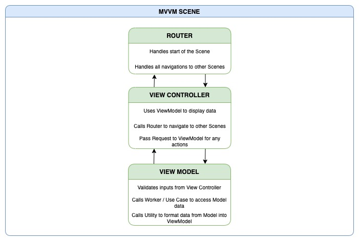

# Framework-Based Modular Clean Architecture with SwiftUI

 
## Intro 

Are you working on a huge project, where a single change leads to the entire project being recompiled and you are wasting a lot of time waiting for it to be completed? Or you are working on a single feature, which is buried deep in your application navigation stack and you need to click through all of the pages just to be able to test a single thing? 

The great solution to those issues is to modularise your project. 

There are several methods to achieve the desired goal, such as creating [Swift Packages](https://www.swift.org/package-manager/) (we discussed this in the [Quick and Simple Modularising your project with Swift Packages](https://sii.pl/blog/en/quick-and-simple-modularising-your-project-with-swift-packages-up-to-date-with-xcode-13-2-1/?category=hard-development&tag=software-development-2) article) or breaking the project into different frameworks to follow the [MicroApps](https://increment.com/mobile/microapps-architecture/) approach. 

Today we will focus on the second approach where we will work on a single workspace with multiple projects (modules) which can be run independently.  

In this article, we will focus on the architecture breakdown and we will talk about the responsibilities of particular parts of the project to follow the [Clean Architecture](https://blog.cleancoder.com/uncle-bob/2012/08/13/the-clean-architecture.html) solution. 

## Project Setup 

We won’t get into much detail in this part, as there are many articles going through the entire process step by step (from which one of my favourites would be the [Modular Architecture in iOS](https://medium.com/@leandromperez/a-modular-architecture-in-swift-aafd9026aa99)).  

I also created the [example project](https://github.com/LooseMarek/FrameworkBasedArchitectureTutorial) where you can see my interpretation of this approach. You can also view the commits history to see how you can create a baseline project step by step from scratch. 

The example project includes two feature modules: `WorkoutLogs` and `WorkoutDetails`. In the first module, you will find a single scene with a list of workout logs fetched from the sample JSON file. In the second module, you will find another scene with details of the workout which would be displayed after pressing the item from the list. 

In practice, usually, the feature modules would be a bit bigger than just a single scene (if this would be a commercial app, I would most likely opt-in for keeping both list and details scene in one module), but I was trying to keep the example as simple as possible. 

Only the main Application project which links all of the modules knows of their existence. Both feature modules are agnostic so when the user clicks on an item from the `WorkoutLogs`, this module doesn’t know that it will use the `WorkoutDetails` module to display details of the workout. This is achieved by using the Routers/Coordinator pattern. 

Since the example project contains demo applications for each feature module, we can observe that when running the `WorkoutDetailsDemo` app, we will immediately see the workout details page without the need to navigate to it. When we run the `WorkoutLogsDemo` app, we can observe the list of workout logs, but when we click on any list items, nothing will happen as the module is “contained” within a single scene. Only when we run the main Application app we can see the list of workout logs and will be able to navigate to the details scene upon clicking on one of them. 

## Clean Architecture in Framework-based Workspace 

    

The workspace consists of the main application project, a group of separate feature modules, a group of common modules, and external dependencies. 

Notice, that each feature module is a separate project, containing all the logical layers (Infrastructure, Domain, and Presentation) whereas in the common group we separate each layer into standalone projects, which can help reduce the number of dependencies for feature modules. 

### Application 

The starting point of the workspace is your application project.  

If you were going through tutorials from the Project Setup chapter, you added this project from the template “app”. 

    

The key responsibility of this module is to glue all the bits and pieces together into a final product, which you will publish to the AppStore. 

As per the diagram at the beginning of this chapter, you can see, that it only contains two subgroups (folders) which are the “app” and the “resources”. Depending on your project you may add there more subgroups and responsibilities to it but ideally is to keep the application project as small as possible. In the example project, the Application project is so small, that I only separated “resources” into one folder keeping two files ApplicationApp and ApplicationRouter at the root level.  

The application project will most likely depend on all other feature modules as well as common modules. All of those dependencies would need to be added as an “Embed & Sign” framework in your target general settings. 

    

### Feature Modules 

Every single module (both from the feature group as well as common group) should be added to the workspace as a separate project based on a “framework” template. 

    

Feature modules mostly depend on modules from the Common group (Infrastructure, Domain, and Presentation) but in some cases, they may depend on other feature modules.  

The important thing to remember is to avoid any circular dependencies, but gladly this will be identified fairly early as the project may throw some runtime errors because of that. 

Finally, any feature modules may also use any specific external dependencies which are not used by any other modules so you can specify this in your Podfile file. 

### Common Modules  

    

As mentioned earlier in this article, every abstraction layer in a common group (Infrastructure, Domain, and Presentation) is separated into its own project.  

It all depends on the size of your project, and the number of features you have in there, but for the smaller project you may think to only separate the Presentation layer (for example naming it `CommonUI`) and keep Infrastructure and Domain as one module (named `CommonBusinessLogic`). You may also not use Workers and only use Use Cases directly in your Scene components. In the example project, I didn’t use both and used Repository directly as there was no need for using Use Cases to let's say synchronize data from `LocalRepository` with `ApiRepository`. 

I like to fragment common abstraction layers to separate projects, as for example if you have a feature module that has its own entities and you are sure they won’t be shared across the rest of the project, you may only need to depend on the Infrastructure module to be able to fetch those entities either from local storage or some API, so in this case, depending on a Common Domain module would be redundant.  

If you work on many projects within your enterprise, you may also have common code shared between the apps, so all of the modules from the Common group are great candidates for converting them to external modules and sharing them across all of the apps as Swift Packages or CocoaPods. 

For example, if you have a service to make network requests or store data in local storage, you may simply extract your entire Common Infrastructure to have a single place for that, and reuse it across many apps as those are rarely changing. 

## Module Targets 

    

The above diagram demonstrates how your project's targets could be organized. 

Starting with the Application project, you can see, that it contains an application target, but also two testing bundles used to test the integration of your entire workspace.  

The Feature Modules can contain much more targets, though it all depends on how big and complex the given feature is. Let's say you have the Auth module which consists of login, registration, forgot password, or terms and conditions scenes. In that module, it might be useful to add an App target to build a demo application. 
This is great as the demo application will have a different bundle identifier so if you run it on a device or simulator, you will see it as a different app, without overriding the main app. 

    

For this, you may also wish to add UI Tests for testing interactions and coordination between scenes, or [Snapshot](https://cocoapods.org/pods/SnapshotTesting) Tests to quickly test UI elements. 

If your feature doesn’t contain any UI elements and only contains some logic, then adding a dedicated demo app might be an overkill and it’s better to only add a playground to demonstrate the way to use the feature. 

I also like to add any Mocks as a separate static library target as it’s easier to reuse them across all testing bundles. That is within the given module (between Unit Tests, UI Tests, or Snapshot Tests) but also for any testing bundles from other modules. 

Any Mock static libraries need to be added to a testing bundle target in Build Phases under “Link Binary With Libraries”. In this way, you can then use it in your test class with “@testable import”. 

    

Finally, The Common Modules are quite similar to the Feature Modules, though the only difference is that they don’t need to have a demo app as they should not contain any scenes, but rather only logic, or reusable generic protocols. 

## Replaceable Presentation Patterns Such as VIP or MVVM 

What is great about the modular approach, is that each module may be treated as a separate unit, therefore it may follow different patterns or use different frameworks.  

For example, you may add a shiny new Feature Module which is using SwiftUI and it might be easier to use the VIP presentation pattern within that module, even though your previous Feature Modules are UIKit based and are using the MVVM presentation pattern.  

If you are using the Routers/Coordinators pattern, you can easily connect those features without compromising the patterns in any of the modules. 

In the example project, the WorkoutLogs module is using the MVVM presentation pattern with the scene created with UIKit.

    

Since the main Application is using SwiftUI, there is also `UIViewControllerRepresentable` which works as a wrapper between UIKit and SwiftUI.  

However, since the `WorkoutDetails` module is a separate project, we can easily use a different presentation pattern for that. The scene in this module has been done with the usage of SwiftUI, therefore I decided to use a VIP presentation pattern. 

    

Those presentation approaches don’t affect the rest of the project as Workers, Use Cases or any abstraction layers from the Common modules are still staying the same, so we may replace our UI with different patterns at any time. 

## Summary 

This article (as well as the example project) demonstrated solutions to some potential problems or “gotchas” which you could come across when working with Framework-Based architecture. I hope it will help you in the journey of modularising your application to make your work much easier and more fun. 

## Resources 

- [Swift Package Manager](https://www.swift.org/package-manager/) 
- [MicroApps Architecture](https://increment.com/mobile/microapps-architecture/)
- [The Clean Architecture](https://blog.cleancoder.com/uncle-bob/2012/08/13/the-clean-architecture.html)  
- [Modular Architecture in Swift](https://medium.com/@leandromperez/a-modular-architecture-in-swift-aafd9026aa99) 
- [(Sii) Quck and Simple Modularising Your Project with Swift Package](https://sii.pl/blog/en/quick-and-simple-modularising-your-project-with-swift-packages-up-to-date-with-xcode-13-2-1/?category=hard-development&tag=software-development-2) 
- [Framework-Based Architecture example](https://github.com/LooseMarek/FrameworkBasedArchitectureTutorial) 
